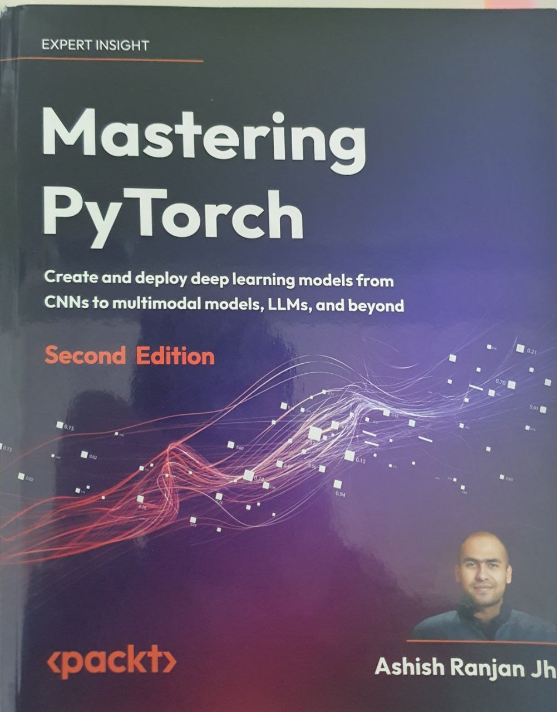

# Mastering PyTorch 2

This repository contains my learning journey through the book "Mastering PyTorch, Second Edition" published by Packt. The repository focuses on implementing deep learning solutions and exploring advanced PyTorch features.

## Book Overview

"Mastering PyTorch 2" is a comprehensive guide that helps readers understand and implement advanced deep learning applications using PyTorch. The book covers everything from basic neural networks to advanced architectures and deployment strategies.

### Key Learning Objectives
- Implement text, vision, and music generation models using PyTorch
- Build deep Q-network (DQN) models
- Deploy PyTorch models on mobile devices (Android and iOS)
- Master rapid prototyping using PyTorch with fastai
- Perform neural architecture search using AutoML
- Interpret machine learning models using Captum
- Design ResNets, LSTMs, and graph neural networks (GNNs)
- Create language and vision transformer models using Hugging Face

## Chapters Covered

### Fundamentals and CNN Architectures
- **Chapter 01**: Overview of Deep Learning Using PyTorch
  - MNIST digits classification implementation
  - Comparison with TensorFlow implementation

- **Chapter 02**: Deep CNN Architectures
  - DenseNet, GoogLeNet, and ResNet implementations
  - Transfer learning with AlexNet
  - LeNet architecture
  - VGG13 pre-trained model inference

### Advanced Neural Networks
- **Chapter 04**: Deep Recurrent Model Architectures
  - LSTM implementation
  - RNN basics and applications

- **Chapter 06**: Graph Neural Networks
  - GNN implementation and applications

- **Chapter 07**: Music and Text Generation with PyTorch
  - Music generation models
  - Text generation implementations
  - GPT-3 text generation examples

### Advanced Topics and Tools
- **Chapter 15**: Rapid Prototyping with PyTorch
  - FastAI integration
  - Poutyne framework usage
  - PyTorch Lightning implementation
  - PyTorch Profiler utilization

- **Chapter 16**: PyTorch and AutoML
  - AutoML-PyTorch implementation
  - Optuna optimization framework

- **Chapter 17**: PyTorch and Explainable AI
  - Captum interpretability
  - PyTorch model interpretation

- **Chapter 18**: Recommendation Systems with PyTorch
  - Implementation of recommendation systems

- **Chapter 19**: PyTorch and Hugging Face
  - HuggingFace Accelerate
  - Working with HuggingFace Datasets
  - HuggingFace Hub integration
  - Model optimization with Optimum
  - PyTorch-HuggingFace integration

## Repository Structure

Each chapter contains Jupyter notebooks with:
- Detailed implementations
- Practical examples
- Code explanations
- Integration with various frameworks

## Running the Notebooks

All notebooks can be run in multiple environments:
- Locally with Jupyter
- Google Colab
- Kaggle Kernels

## Requirements

- PyTorch 2.x
- Python 3.8+
- Additional dependencies per chapter requirements
